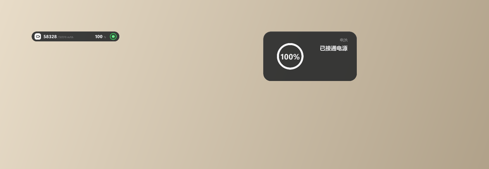

# DynamicIsland

仿 macOS 灵动岛风格的 Windows 电量悬浮窗，常驻屏幕顶部，实时显示电池电量、毫安容量与充电状态。基于 PySide6，无边框逐像素透明窗口 + QPainter 绘制，无第三方托盘库依赖。



## 功能

- 收起态为屏幕顶部的窄长胶囊：充电徽章（充电时为闪电）、当前毫安 / 设计容量、百分比、环形电量计
- 左键点击展开面板：大号百分比、充电状态文案、剩余使用时间估算
- 充电中显示闪电图标，电量低于 20% 且未充电时整条变红警示
- 按住拖动可放到屏幕任意位置，悬停轻微放大，开场有扫光动画
- 每 3 秒刷新一次电量，直接读取系统电源接口与电池驱动，后台零占用

## 运行

需要 Python 3.10+ 和 Windows 10/11。

```bat
pip install -r requirements.txt
python main.py
```

只查看电量数据不启动界面：

```bat
python main.py --check
```

## 打包 exe

```bat
build.bat
```

产物在 `dist\DynamicIsland.exe`，单文件、无控制台窗口。

## 操作

| 操作 | 效果 |
| --- | --- |
| 左键点击 | 展开 / 收起 |
| 按住拖动 | 移动位置 |
| 连续两次右键 | 退出 |

## 目录结构

```
├── main.py                  # 程序入口
├── dynamic_island/
│   ├── app.py               # QApplication 启动与命令行参数
│   ├── config.py            # 窗口尺寸、几何常量、字体栈
│   ├── utils.py             # clamp / lerp
│   ├── battery/
│   │   ├── status.py        # 电量百分比、充电状态、剩余时间
│   │   └── capacity.py      # 电池毫安容量（驱动 IOCTL + WMI 回退）
│   └── ui/
│       ├── island.py        # 灵动岛窗口、动画与交互
│       ├── render.py        # 收起态胶囊与展开面板的绘制
│       └── theme.py         # 配色与字体
├── DynamicIsland.spec       # PyInstaller 打包配置
├── build.bat                # 一键依赖安装 + 打包
└── requirements.txt
```
